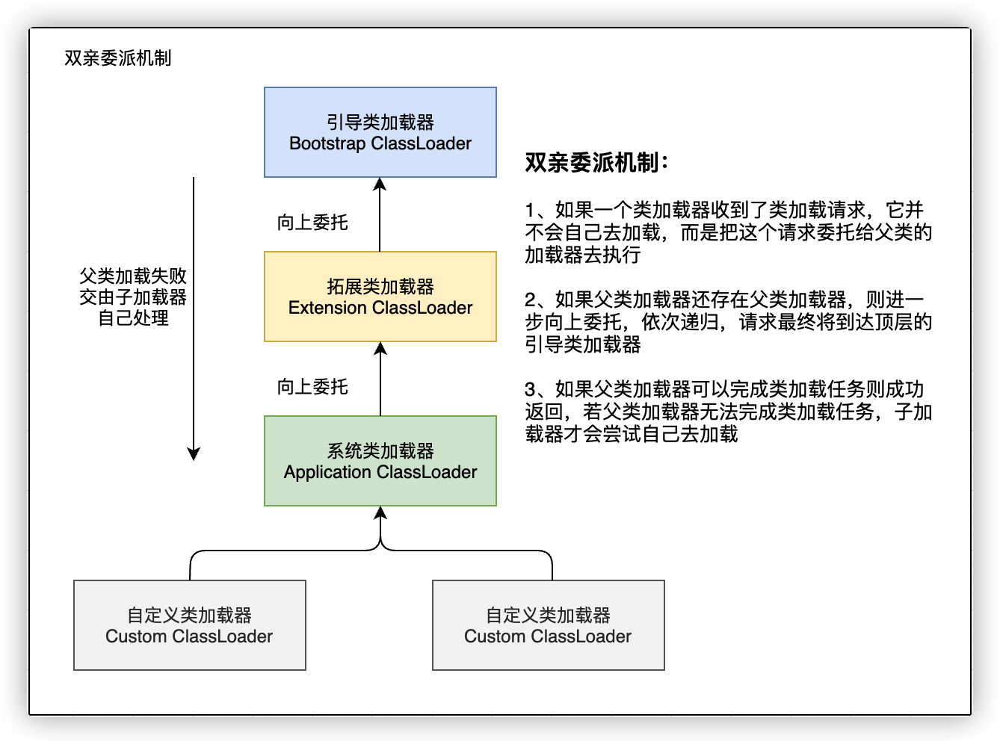
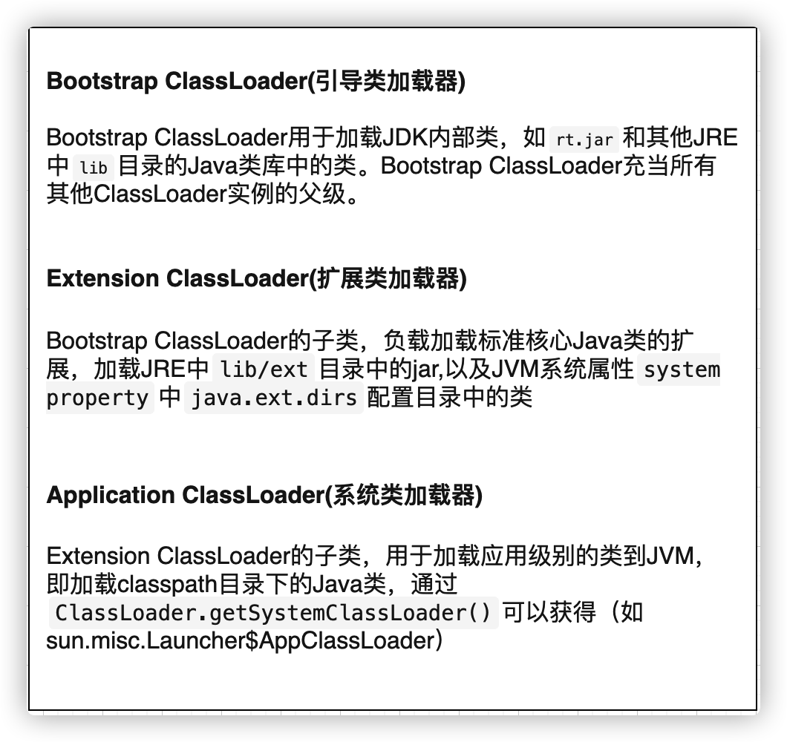
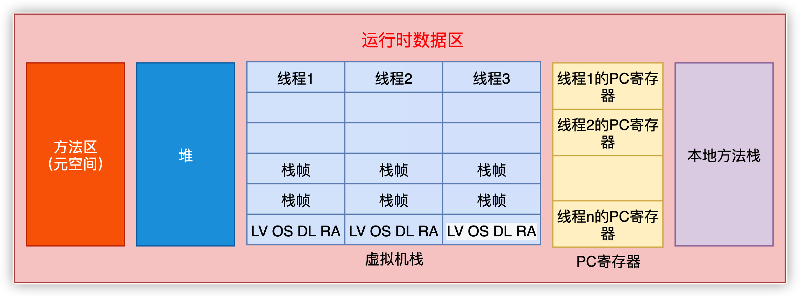
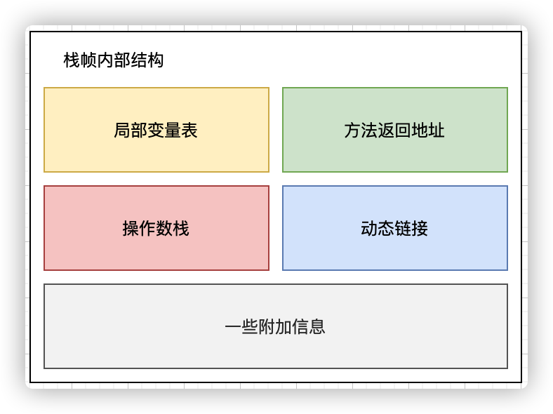
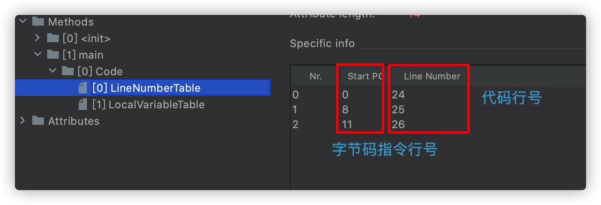
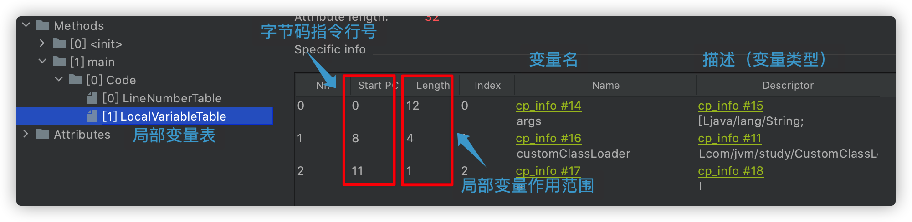
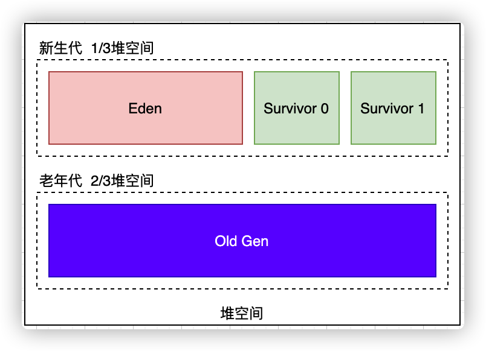

## JVM 与 Java 体系结构

### 1、Java虚拟机（JVM，Java Virtual Machine）

- Java虚拟机就是一台执行Java字节码的虚拟计算机，它拥有独立的运行机制，其运行的字节码未必由Java语言编译而成
- JVM平台各种语言可以共享Java虚拟机带来的跨平台性、优秀的垃圾回收器以及可靠的即时编译器
- Java技术的核心就是Java虚拟机，因为所有的Java程序都运行在Java虚拟机内部

Java虚拟就是二进制字节码的运行环境，负责装载字节码到其内部，解释/编译为对应平台上的机器指令执行。Java虚拟机的特点：

- 一次编译，到处运行
- 自动内存管理
- 自动垃圾回收功能


### 2、JVM的整体结构

HotSpot VM是目前市面上高性能虚拟机的代表作之一，它采用解释器与即时编译器并存的架构。


### 3、JVM的架构模型

Java编译器输入的指令流基本上是一种基于 `栈` 的指令及集架构，另一中指令集架构则是基于寄存器的指令架构。这两种架构之间的区别：

**基于栈式架构的特点：** 

- 设计和实现更简单，适用于资源受限的系统
- 避开了寄存器的分配难题，使用零地址指令方式分配
- 指令流中的指令大部分是零地址指令，其执行过程依赖于操作栈。指令集更小，编译器容易实现。
- 不需要硬件支持，可移植性更好，更好的实现跨平台

**基于寄存器架构的特点：** 

- 典型的应用是 x86 的二进制指令集，比如传统的PC以及Android的 Davlik 虚拟机
- 指令集架构则完全依赖硬件，可移植性差
- 性能优秀和执行更高效
- 花费更少的执行去完成一项操作
- 在大部分情况下，基于寄存器机构的指令集往往都以一地址指令、二地址指令和三地址指令为主。二基于栈式架构的指令集却是以领地址指令为主

**举例：**  

同样执行 `2+3` 这种逻辑操作其指令分别如下：

```java
// 基于栈的计算流程（以Java虚拟机为例）
iconst_2	// 常量2入栈
istore_1
iconst_3	// 常量3入栈
istore_2
iload_1
iload_2
iadd		// 常量2、3出栈执行相加
istore_0	// 结果5入栈
```

```java
// 基于寄存器的计算流程
mov eax,2	// 将eax的寄存器值设为2
add eax,3	// 将eax寄存器的值加3
```

> 基于栈式架构：跨平台性、指令集小、指令多；执行性能比寄存器差


### JVM的生命周期

**虚拟机的启动：** 

Java虚拟机的启动是通过引导类加载器（bootstrap class loader）创建一个初始类（initial class）来完成的，这个类是由虚拟机的具体实现指定的。

**虚拟机的执行：** 

- 一个运行中的Java虚拟机有着一个清晰的任务：执行Java程序
- 程序开始执行时它才运行，程序结束时它就停止
- 执行一个所谓的Java程序的时候，真正在执行的是一个叫做Java虚拟机的进程

**虚拟机的退出：** 

- 程序正常执行结束
- 程序在运行过程中遇到了异常或错误而异常终止
- 由于操作系统出现错误而导致Java虚拟机进程终止
- 某线程调用 `Runtime` 类或者 `System` 类的 `exit` 方法，或 `Runtime` 类的 `halt` 方法。并且Java安全管理器也允许这次 `exit` 或 `halt` 操作
- 除此之外，JNI（Java Native Interface）规范描述了用 `JNI Invocation API ` 来加载或卸载Java虚拟机时，Java虚拟机的退出情况


### 5、JVM的发展历程

- **Sun Classic VM** 

    第一款商用的Java虚拟机，JDK1.4时淘汰。 `Hotspot` 内置了次虚拟机

- **Exact VM** 

    准确式内存管理。具备现代高性能虚拟机的雏形（热点探测、编译器与解释器混合工作模式）。最终被 `Hotspot` 虚拟机代替

- **Hotspot VM（重点）** 

    Sun/Oracle JDK 和 OpenJDK 的默认虚拟机。通过计数器找到最具编译价值的代码，触发即时编译或栈上替换；通过编译器与解释器协同工作，在最优化的程序相应时间与最佳执行性能中取得平衡。

- **JRockit** 

    专注于服务端应用，`JRockit` 内部不包含解析器实现，全部代码都靠即时编译器编译后执行。`JRockit JVM`   是最快的 JVM。 
    
- **J9** 

    广泛用于 `IBM` 的各种Java产品，是有影响力的三大商用虚拟机之一。


## 类加载子系统

### 1、类加载器与类的加载过程

类加载器子系统负责从文件系统或者网络中加载 Class 文件，class文件在文件的开头有特定的文件标识。`ClassLoader` 只负责 class 文件的加载，至于 class 文件是否可以运行则由 `Execution Engine` 决定。加载的类信息存放在一块称为 `方法区` 的内存空间，除了类的信息外，方法区中还会存放运行时常量池信息，可能还包括字符串字面量和数字常量（这部分常量信息是Class问价中常量池部分的内存映射）。

类加载器子系统分为3个阶段：加载阶段、链接阶段（验证；准备；解析）、初始化阶段

### 2、类的加载过程

- **加载** 

    通过一个类的全限定名获取定义此类的二进制字节流；将这个字节流代表的静态存储结构转化为方法区的运行时数据结构；在内存中生成一个代表这个类的 `java.lang.Class` 对象，作为方法区这个类的各种数据的访问入口。

- **链接** 

    - 验证（Verify）

        目的在于确保Class文件的字节流中包含信息符合当前虚拟机的要求，保证被加载类的正确性，不会危害虚拟机的自身安全。主要包括四种验证：文件格式验证、元数据验证、字节码验证、符号引用验证。

    - 准备（Prepare）

        为类变量设置内存并且设置该类变量的初始默认值；这里不包含用 `final` 修饰的 `static` 因为 `final` 在编译的时候就会分配，准备阶段会显式初始化；这里不会为实例变量分配初始化，类变量会分配的方法区中，而实例变量会随着对象一起分配到堆中。

    - 解析（Resolve）

        将常量池中的符号引用转换成直接引用的过程；解析操作往往会伴随着JVM在执行完初始化之后再执行；符号引用就是一组符号来描述所引用的目标；直接引用就是直接指向目标的指针、相对偏移量或一个间接定位到目标的句柄。

        解析动作主要针对 `类或接口` 、 `字段` 、 `类方法` 、 `接口方法` 、 `方法类型` 等。对应常量池中 `CONSTANT_Class_info` 、 `CONSTANT_Fieldref_info` 、 `CONSTANT_Methodref_info` 等。
    
- **初始化** 

    初始化阶段就是执行类构造器方法 `<clinit>()` 的过程；此方法不需要定义是 javac 编译器自动收集类中的所有类变量赋值动作和静态代码块中的语句合并而来；构造器方法中指令按语句在源文件中出现的顺序执行。

    `<clinit>()` 不同于累的构造器（类构造器是虚拟机视角下的 `<init>()`）；若该类具有父类，JVM会保证子类的 `<clinit>()` 执行前，父类的 `<clinit>()` 已经执行完毕。虚拟机必须保证一个类的 `<clinit>()` 方法在多线程下被同步加锁。

    > 类变量：定义在类中，方法体之外，但必须要有 `static` 来声明变量类型
    >
    > 成员变量：定义在类中，方法体之外。变量在创建对象时实例化。

### 3、类加载器的分类

JVM支持两种类型的类加载器，分别为 `引导类加载器(Bootstrap ClassLoader)` 和 `自定义类加载器(User-Defined ClassLoader)` 。从概念上讲，自定义类加载器一般指的是程序中由开发人员自定义的类加载器，但是Java虚拟机规范却没有这么定义，而是将所有派生于抽象类 `ClassLoader` 的类加载器都划分为自定义类加载器。无论类加载器的类型如何划分，在程序中我们常见的类加载器始终只有3个，类加载器之间是包含关系，不是父子类之间的继承关系。

```java
public static void main(String[] args) {
    // 获取系统默认的类加载器      sun.misc.Launcher$AppClassLoader@18b4aac2
    ClassLoader systemClassLoader = ClassLoader.getSystemClassLoader();
    System.out.println(systemClassLoader);

    // 获取系统默认的类加载的上级类加载器    sun.misc.Launcher$ExtClassLoader@61bbe9ba
    ClassLoader systemClassLoaderParent = systemClassLoader.getParent();
    System.out.println(systemClassLoaderParent);

    // 获取引导类加载器     无法获取 null
    ClassLoader bootstrapClassLoader = systemClassLoaderParent.getParent();
    System.out.println(bootstrapClassLoader);

    // Java的核心类库都是使用引导类加载器加载的
    ClassLoader classLoader = String.class.getClassLoader();
    System.out.println(classLoader);

    // 获取引导类加载器加载的api的路径
    URL[] urLs = Launcher.getBootstrapClassPath().getURLs();
    for (URL urL : urLs) {
        System.out.println(urL);
    }

    System.out.println("----------扩展类加载器----------");
    String property = System.getProperty("java.ext.dirs");
    for (String s : property.split(":")) {
        System.out.println(s);
    }
}
```

输出结果：

```
sun.misc.Launcher$AppClassLoader@18b4aac2
sun.misc.Launcher$ExtClassLoader@61bbe9ba
null
null
file:/Library/Java/JavaVirtualMachines/jdk1.8.0_241.jdk/Contents/Home/jre/lib/resources.jar
file:/Library/Java/JavaVirtualMachines/jdk1.8.0_241.jdk/Contents/Home/jre/lib/rt.jar
file:/Library/Java/JavaVirtualMachines/jdk1.8.0_241.jdk/Contents/Home/jre/lib/sunrsasign.jar
file:/Library/Java/JavaVirtualMachines/jdk1.8.0_241.jdk/Contents/Home/jre/lib/jsse.jar
file:/Library/Java/JavaVirtualMachines/jdk1.8.0_241.jdk/Contents/Home/jre/lib/jce.jar
file:/Library/Java/JavaVirtualMachines/jdk1.8.0_241.jdk/Contents/Home/jre/lib/charsets.jar
file:/Library/Java/JavaVirtualMachines/jdk1.8.0_241.jdk/Contents/Home/jre/lib/jfr.jar
file:/Library/Java/JavaVirtualMachines/jdk1.8.0_241.jdk/Contents/Home/jre/classes
----------扩展类加载器----------
/Users/wufan/Library/Java/Extensions
/Library/Java/JavaVirtualMachines/jdk1.8.0_241.jdk/Contents/Home/jre/lib/ext
/Library/Java/Extensions
/Network/Library/Java/Extensions
/System/Library/Java/Extensions
/usr/lib/java
```

**启动类加载器（引导类加载器  Bootstrap ClassLoader）** 

- 这个类加载器使用 `C/C++` 实现，嵌套在JVM 内部
- 它用来加载Java的核心类库（JAVA_HOME/jre/lib/rt.jar、resources.jar 或 sun.boot.class.path 路径下的内容）用于提供JVM自身需要的类
- 并不继承自 `java.lang.ClassLoader` 没有父加载器
- 加载扩展类和应用程序类加载器，并指定为它们的父类加载器
- 处于安全考虑，BootStrap ClassLoader 只加载包名为 `java` `javax` `sun` 等开头的类

**扩展类加载器（Extension ClassLoader）** 

- Java语言编写，由 `sun.misc.Launcher$ExtClassLoader` 实现
- 派生于 `ClassLoader` 类
- 父类加载器为启动类加载器
- 从 `java.ext.dirs` 系统属性所指定的目录中加载类库或者从JDK的安装目录 `jre/lib/ext` 子目录下加载类库。如果用户创建的jar也放在此目录下也会由扩展类加载器加载。

**应用程序类加载器（系统类加载器  AppClassLoader）** 

- Java语言编写，由 `sun.misc.Launcher$AppClassLoader` 实现
- 派生于 `ClassLoader` 类
- 父类加载器为扩展类加载器
- 它负责加载环境变量 `classpath` 或系统属性 `java.class.path` 指定路径下的类库
- 该类加载器是程序中默认的类加载器，一般来说Java应用的类都是由它来完成加载
- 通过 `ClassLoader#getSystemClassLoader()` 方法可以获取到该类加载器

**用户自定义类加载器实现步骤：** 

1. 通过继承抽象类 `java.lang.ClassLoader` 类的方式实现自己的类加载器
2. 在JDK1.2之后不建议用户去覆盖 `loadClass()` 方法，而是建议把自定义类加载器的逻辑写在 `findClass()` 中
3. 在编写自定义类加载器时，如果没有特殊的需求，可以直接继承 `URLClassLoader` 这样可以避免自己去编写 `findClass()` 方法及其获取字节码流的方式，使自定义的类加载器更加简洁

### 4、ClassLoader 的常用方法

|                        方法名称                        |                             描述                             |
| :----------------------------------------------------: | :----------------------------------------------------------: |
|                     `getParent()`                      |                  返回该类加载器的超类加载器                  |
|                `loadClass(String name)`                | 加载名称为 name 的类，返回结果为 `java.lang.Class` 类的实例  |
|                `findClass(String name)`                | 查找名称为 name 的类，返回结果为 `java.lang.Class` 类的实例  |
|             `findLoadedClass(String name)`             | 查找名称为 name 的已经被加载的类，返回结果为 `java.lang.Class` 类的实例 |
| `defineClass(String name, byte[] b, int off, int len)` | 把字节数组b中的内容转换成一个Java类，返回结果为 `java.lang.Class` 类的实例 |
|               `resolveClass(Class<?> c)`               |                     连接指定的一个Java类                     |

**获取 `ClassLoader` 的途径：** 

- 获取当前类的 ClassLoader： `clazz.getClassLoader();` 
- 获取当前线程上下文的 ClassLoader： `Thread.currentThread().getContextClassLoader();` 
- 获取系统的 ClassLoader： `ClassLoader.getSystemClassLoader();` 
- 获取调用者的 ClassLoader： `DriverManager.getCallerClassLoader();` 

### 5、双亲委派机制

Java虚拟机对 Class 文件采用的是按需加载的方式，当需要使用该类是才会将它的 class 文件加载到内存中生成 class 对象。而加载某个类的 class 文件时，Java虚拟机采用的是双亲委派模式，即把请求交给父类处理，它是一种任务委派模式。





**双亲委派机制的有点：** 

- 避免类的重复加载，
- 保护程序安全，防止核心 API 被篡改

### 6、其它

在JVM中标识两个 class 对象是否为同一个类存在的两个必要条件：

- 类的完整类名必须一致，包括包名
- 加载这个类的` ClassLoader` （指ClassLoader实例对象） 必须相同

JVM必须知道一个类型是由 `启动类加载器` 加载的还是由 `用户类加载器` 加载的。如果一个类型是由用户类加载器加载的，那么 JVM 会将这个类加载器的一个引用作为类型信息的一部分保存在方法区中。当解析一个类型到另一个类型的引用的时候，JVM 需要保证这两个类型的类加载器是相同的。

**类的主动使用和被动使用：** 

主动使用：

- 创建类的实例
- 访问某个类或接口的静态变量，或者对该静态变量赋值
- 调用类的静态方法
- 反射（比如：`Class.forName("")`）
- 初始化一个类的子类
- Java虚拟机启动时被标明为启动类的类
- JDK7 开始提供的动态语言的支持 `java.lang.invoke.MethodHandle` 实例的解析结果 `REF_getStatic` 、 `REF_putStatic` 、 `REF_invokeStatic` 句柄对应的类没有初始化则初始化

被动使用：

- 除以上7种，其它使用 Java 类的方式都被看做是对类的被动使用，都不会导致类的初始化


## 运行时数据区

Java虚拟机定义了若干种程序运行期间会使用到的运行时数据去，其中有一些会随着虚拟机启动而创建，随着虚拟机退出而销毁。另一些则是与线程一一对应的，这些与线程对应的数据区域会随着线程开始和结束而创建和销毁。

> 每个线程独享：程序计数器、栈、本地栈
>
> 线程间共享：堆、堆外内存（永久代或元空间、代码缓存）



### 1、线程

线程是一个程序里的运行单元，JVM允许一个应用有多个线程并行执行。在 `Hotspot` 虚拟机里，每个线程都与操作系统的本地线程直接映射（当一个Java线程准备好执行后，此时一个操作系统的本地线程也同时创建，Java线程执行终止后，Java线程也会回收）。操作系统负责所有线程安排调度到任何一个可用的CPU上，一旦本地线程初始化成功，就会调用Java线程中的 `run()` 方法。

**Hotspot JVM后台系统线程：** 

- 虚拟机线程
- 周期任务线程
- GC线程
- 编译线程
- 信号调度线程

### 2、程序计数器（PC寄存器）

JVM程序计数寄存器（Program Counter Register）这里并非广义上所指的物理物理寄存器，将其翻译成 `PC计数器` 会更加贴切。JVM中的PC寄存器是对物理PC寄存器的一种抽象模拟。

>PC寄存器用来存储指向下一条指令的地址，也即将要执行的指令代码。由执行引擎读取下一条指令。

PC寄存器是一块很小的内存空间，几乎可以忽略不计，也是运行速度最快的存储区域。在JVM规范中每个线程都有自己的程序计数器，是线程私有的，生命周期与线程的生命周期保持一致。任何时间一个线程都只有一个方法在执行，也就是所谓的当前方法。程序计数器会存储当前线程正在执行的Java方法的JVM指令地址。如果是在执行 `native` 方法，则是未指定值 `undefined` 。

PC寄存器是程序控制流的指示器，分支、循环、跳转、异常处理、线程恢复等基础功能都需要依赖这个计数器来完成。字节码解释器工作时就是通过改变这个计数器的值来选取下一条需要执行的字节码指令。它是唯一一个在Java虚拟机规范中没有规定任何 `OutOtMemoryError` 情况的区域。

**常见的问题：** 

- **使用PC寄存器存储字节码指令地址有什么用？（为什么使用PC寄存器记录当前线程的执行地址？）** 

    因为CPU需要不停的切换各个线程，当切换回来之后需要知道程序要从哪里接着执行。JVM 的字节码解释器需要通过改变PC寄存器的值来明确下一条应该执行什么样的字节码指令。

- **PC寄存器为什么被设定为线程私有的？** 

    多线程在一个特定的时间段内只会执行其中某一个线程的方法，CPU会不停的做任务切换，这样必然导致经常中断或恢复，为了准确的记录各个线程当前正在执行的字节码指令地址，最好的办法就是为每一个线程分配一个PC寄存器。这样各个线程就可以进行独立计算，不会出现相互干扰。

### 3、虚拟机栈

由于跨平台性的设计，Java的指令都是根据栈来设计的，不同平台CPU的架构不同，所以不能设计为基于寄存器的。优点是跨平台，指令集小，编译器容易实现；缺点是性能下降实现同样的功能需要更多的指令。

==栈是运行时的单位，堆是存储的单位== 即：栈解决程序的运行问题，程序如何运行，如何处理数据；堆解决的是数据存储问题，数据怎么放，放在哪。

Java虚拟机栈（Java Virtual Machine Stack）早期也叫做Java栈，每个线程在创建时都会创建一个虚拟机栈，其中内部保存一个个的栈针（Stack Frame），对应着一次次的Java方法调用。生命周期和线程一致，主管Java程序的运行，它保存方法的局部变量（基本数据类型、对象的引用地址）、部分结果，并参与方法的调用和返回。

**栈的特点：** 

栈是一种快速有效的分配存储方式，访问速度仅次于程序计数器。JVM直接对Java栈的操作只有两个（方法执行，入栈；执行结束后出栈）对于栈来说不存在垃圾回收问题。

栈中可能出现的异常： `StackOverflowError` `OutOfMemoryError` 

> 使用 `-Xss` 可以设置线程的最大栈空间

### 4、栈的存储单位（栈帧）

每个线程都有自己的栈，栈中的数据都是以 `栈帧（Stack Frame）` 的格式存在；在这个线程上正在执行的每个方法都有各自对应的一个栈帧；栈帧是一个内存区块，是一个数据集，维系着方法执行过程中的各种数据信息。

JVM直接对Java栈的操作只有两个，就是对栈帧的 `压栈` 和 `出栈` 遵循先进后出的原则。在一条活动线程中，一个时间点上只会有一个活动的栈帧，只有当前正在执行的方法的栈帧（栈顶栈帧）是有效的，这个栈帧被称为 `当前栈帧（Current Frame）` 与当前栈帧相对应的方法就是 `当前方法（Current Method）` 定义这个方法的类就是 `当前类（Current Class）` 。

执行引擎执行的所有字节码指令只针对当前栈帧进行操作。如果在方法中调用了其它方法，对应的新的栈帧就会被创建出来，放在栈的顶端，成为新的当前帧。

不同线程中所包含的栈帧是不允许存在相互引用的，即不可能在一个栈帧之中引用另一个线程的栈帧。如果当前方法调用了其它方法，方法返回之际，当前栈帧会传回此方法的执行结果给前一个栈帧，接着虚拟机会丢弃当前栈帧，使得前一个栈帧称为当前栈帧。

Java方法有两种返回函数的方式：

- 正常的函数返回，使用 `return` 指令
- 抛出异常

不管哪种方式都会导致栈帧被弹出。

**每个栈帧中存储着：** 

- 局部变量表（Local Variables）
- 操作数栈（Operand Stack）
- 动态链接（Dynaic Linking）指向运行时常量池的方法引用
- 方法返回地址（Return Address）
- 一些附加信息



#### 4.1 局部变量表

局部变量表也被称为局部变量数组或本地变量表；定义为一个数字数组，主要用于存储方法参数和定义在方法体内部的局部变量。这些数据类型包括各种 `基本数据类型` 、 `对象引用（reference）` 以及 `return AAddress` 类型。

由于局部变量表是建立在线程的栈上，是线程的私有数据，因此不存在数据安全问题。

局部变量表所需的容量大小是在编译期确定下来的，并保存在方法的 `Code` 属性的 `maximum local veriables` 数据项中，在方法运行期间是不会改变局部变量表的大小的。

方法嵌套调用的次数由栈的大小决定，一般来说，栈越大，方法嵌套调用次数越多。局部变量表中的变量只有在当前方法中有效。当方法调用结束后，随着方法栈帧的销毁，局部变量表也会随之销毁。

#### 4.2 字节码方法内部结构：





#### 4.3 关于 slot 的理解

参数值的存放总是在局部变量数组的 `index0` 开始到数组 `长度-1` 的索引结束；局部变量表最基础的单元是 Solt （变量槽）局部变量表中存放编译期可知的各种基本数据类型、引用类型、returnAddress类型的变量。

在局部变量表中， ==32位以内的类型只占一个slot（包括 returnAddress类型），64位的类型（long 和 double）占用两个slot== 

`byte、short、char` 在存储前被转换成 `int` ，`boolean` 也被转换成 `int` 0表示false，非0表示true。`long ` 和 `double` 则占两个 slot

JVM会为每个 `slot` 分配一个访问索引，通过这个索引即可成功访问局部变量表中局部变量的值。当一个实例方法被调用的时候，它的方法参数和方法体内部定义的局部变量将会按顺序被复制到局部变量表中的每一个 slot 上。

如果访问局部变量表中一个 64bit 的局部变量时只需要使用前一个索引即可。如果当前帧是由构造方法或实例方法创建的，那么该对象引用 `this` 将会存放在index为0的slot处，其余参数按照参数顺序继续排列。

>静态方法中不能使用 `this` 关键字，因为静态方法的局部变量表中不存在当前对象的引用 `this` 

栈帧中局部变量表的槽位是可以重复利用的，如果一个局部变量过了其作用域，那么在其作用域之后声明的变量就很有可能会复用过期局部变量的槽位。

#### 4.4 静态变量与局部变量的对比

变量的分类：

- 按数据类型分：
    - 基本数据类型
    - 引用数据类型
- 按声明位置分：
    - 成员变量（在使用前都经历过默认初始化赋值）
        - 类变量（被 `static` 修饰的变量）类加载时 `linking` 阶段的 `prepare` 给类变量默认赋值，在初始化阶段给类变量显式赋值及静态代码块赋值。 
        - 实例变量：随着对象的创建会在堆空间中分配实例变量空间并进行默认赋值
    - 局部变量：在使用前必须要进行显示赋值，否则编译出错

> 在栈帧中，与性能调优关系最密切的部分就是局部变量表，在方法执行是虚拟机使用局部变量表完成方法调用时的参数传递；局部变量表中的变量也是重要的垃圾回收根节点，只要被局部变量表中直接或间接引用的对象都不会被回收。

#### 4.5 操作数栈（Operand Stack）

每个独立的栈帧中除了包含局部变量表外还包含一个操作数栈，也可以称为 `表达式栈` ；操作数栈在方法执行过程中，根据字节码指令，往栈中写入数据或提取数据。

操作数栈主要用于保存计算过程的中间结果，同时作为计算过程中变量的临时存储空间。操作数栈就是JVM执行引擎的一个工作区，每一个操作数栈都会有一个明确的栈深度用于存储数值，其所需要的最大栈深度在编译期就定义好了。操作数栈并非采用访问索引的方式进行数据访问， ==只能通过标准的 入栈 / 出栈 操作完成数据访问== 

如果调用的方法有返回值，返回值将会被压入当前栈帧的操作数栈中，并更新PC寄存器中下一条需要执行的字节码指令。

Java虚拟机的解释引擎是基于栈的执行引擎，这里的栈指的就是操作数栈。

#### 4.6 动态链接

或指向运行时常量池的方法引用。每一个栈帧内部都包含一个指向运行时常量池中该栈帧所属方法的引用，包含这个引用的目的是为了支持当前方法的代码能够实现 `动态链接（Dynamic Linking）` 在Java源文件被编译到字节码文件中时所有的变量和方法引用都作为符号引用保存在 Class 文件的常量池中。 ==动态链接的作用就将这些符号引用转换为调用方法的直接引用== 

#### 4.7 方法的调用

在JVM中，将符号引用转换为调用方法的直接引用与方法的绑定机制相关。

**静态链接：** 

当一个字节码文件装载进JVM时，如果被调用的目标方法在编译期可知，且运行期保持不变。这种情况下将调用方法的符号引用转换为直接引用的过程称之为静态链接。

**动态链接：** 

如果被调用方法在编译期无法被确定下来，只能够在程序运行期将被调用方法的符号引用转换为直接引用，由于这种转换过程具有动态性，因此也被称为动态链接。

对应方法的绑定机制为：早期绑定和晚期绑定，绑定是一个字段、方法或者类在符号引用被替换为直接引用的过程，这仅仅发生一次。早期绑定对应 `静态链接` ，晚期绑定对应 `动态链接` 

**非虚方法：** 

如果方法在编译期就确定了具体的调用版本，这个版本在运行期是不可变的，这样的方法被称为 `非虚方法` 

`静态方法、私有方法、final方法、实例构造器、父类方法` 都是非虚方法。其它方法称为 `虚方法` 

**方法调用指令：** 

- `invokestatic` 调用静态方法，解析阶段确定唯一方法版本
- `invokespecial` 调用 \<init\> 方法、私有及父类方法，解析阶段确定唯一方法版本
- `invokevirtual` 调用所有虚方法
- `invokeinterface` 调用接口方法
- `invokedynamic` 动态解析需要调用的方法，然后执行

> `invokestatic` 和 `invokespecial` 指令调用的方法被称为非虚方法，其余的（`final` 修饰的除外）称为虚方法

#### 4.8 方法返回地址

存放调用该方法的PC寄存器的值，一个方法的结束有两种方式：正常执行结束和出现未处理的异常，非正常退出。无论通过哪种方式退出，在方法退出后都返回到该方法被调用的位置，方法正常退出时，调用者的PC寄存器的值作为返回地址，即调用该方法的指令的下一条指令地址。通过异常退出的，返回地址要通过异常表来确定，栈帧中一般不会保存这部分信息。通过异常完成出口退出的不会给上层方法调用者产生任何返回值。

### 5、本地方法接口

一个 `Native Method` 就是一个Java调用非Java代码的接口。`native` 修饰的方法没有方法体，不能和 `sbatract` 共用。

本地方法存在的意义：与Java环境外交互、与操作系统交互、Sun's Java

有时Java应用需要与Java环境外交互，这是本地方法存在的主要原因。通过本地方法可以实现与底层系统交互。

### 6、本地方法栈（Native Method Stack）

Java虚拟机栈用来Java方法的调用，而本地方法栈用来管理本地方法的调用。本地方法栈也是线程私有的，允许被实现成固定或可动态扩容的内存大小。在本地方法栈中登记 `native` 方法，在执行引擎执行时加载本地方法库。

当某个线程调用一个本地方法时，它就进入一个全新的并且不再受虚拟机限制的世界。并不是所有的JVM都支持本地方法，因为Java虚拟机规范并没有明确要求本地方法栈的使用语言、具体实现方式、数据结构等。

> 在 `Hotspot JVM` 中，直接将本地方法栈和虚拟机栈合二为一

### 7、堆

一个JVM实例只存在一个堆内存，堆也是Java内存管理的核心区域。Java堆区在JVM启动的时候被创建，其空间大小也被确定下来。堆可以在物理内存上是不连续的存储空间，但在逻辑上应该被视为连续的。所有的线程共享Java堆，还可以划分线程私有的缓冲区（Thread Local Allocation Buffer，TLAB）

所有的对象实例以及数组都应当在运行时分配在堆上，对象和数组可能永远不会存储在栈上，因为栈帧中保存引用，这个引用指向对象或数组在堆中的位置。在方法结束后堆中的对象不会马上被移除，仅仅在垃圾回收才被移除。堆是GC（Garbage Collection）执行的重点区域

#### 7.1 内存细分

现代垃圾收集器大部分都基于分代收集理论设计，堆空间细分为：

- Java7及之前堆内存逻辑上分为3部分：新生代 + 老年代 + 永久代

- Java8及之后堆内存逻辑上分为3部分：新生代 + 老年代 + 元空间

    `Young Generation Space` 新生代（又被划分为 `Eden区` 和 `Survivor区`）

    `Tenure Generation Space` 老年代

    `Meta Space` 元空间

#### 7.2 设置堆内存大小与OOM

Java堆用于存储Java对象实例，堆的大小在JVM启动时就已经设定好了，也可以通过 `-Xms` 和 `-Xmx` 来设置

>`-Xms` 表示堆区的起始内存，等价于：`-XX:InitialHeapSize` 
>
>`-Xmx` 表示堆区的最大内存，等价于： `-XX:MaxHeapSize` 
>
>`-Xms1024M -Xmx1024M` 

一但堆区中的内存大小超过 `-Xmx` 所指定的最大内存时，将会抛出 `OutofMemoryError` 异常。通常会将 `-Xms` 和 `-Xmx` 两个参数配置相同的值，目的是为了能够在Java垃圾回收机制清理完堆区后不需要重新分隔计算堆区的大小，从而提高性能。

默认情况下初始内存大小：`物理电脑内存大小 / 64` 最大内存大小： `物理电脑内存大小 / 4` 

#### 7.3 新生代与老年代

存储在JVM中的对象可以划分为两类：一类是生命周期较短的瞬时对象，这类对象的创建和消亡都非常迅速；另一类对象的生命周期却非常长，在某些极端的情况下还能够与JVM的生命周期保持一致。

Java堆区进一步细分还可以划分为新生代和老年代，其中新生代有可以划分为 `Eden空间` `Survivor0空间` `Survivor1空间` 也可以叫做 `from区` 和 `to区` 



> 配置新生代与老年代的堆结构占比：
>
> 默认 `-XX:NewRatio=2` 表示新生代占 1，老年代占 2
>
> `-XX:NewRatio=4` 表示新生代占 1，老年代占 4
>
> `jps` 
>
> 使用 `jinfo -flag NewRatio 进程id` 查看堆空间的比例
>
> 使用 `jstat -gc 进程id` 查看gc的空间分配
>
> `-XX:-UseAdaptiveSizePolicy` 关闭自适应的内存分配策略
>
> `-Xmn` 设置新生代的空间大小
>
> `-XX:SurvivorRatio=5` 

在Hotspot中， `Eden区` 和另外两个 `Survivor区` 的缺省比例是 `8:1:1` 可以通过 `-XX:SurvivorRatio` 调整空间比例。几乎所有的Java对象都是在 `Eden区` 被new出来。 ==由于默认的自适应内存分配策略导致新生代的比例不是8:1:1== 

#### 7.4 内存分配过程

1. new的对象先放在伊甸园区，此区有大小限制

2. 当伊甸园区的空间填满时，程序又需要创建对象，JVM的垃圾回收器将对伊甸园区进行垃圾回收 `Minor GC` 将伊甸园区中的不再被其它对象所引用的对象销毁。

3. 然后将伊甸园区中的剩余对象放到幸存者0区

4. 如果再次触发垃圾回收，此时上次幸存下来的放在幸存者0区的对象如果没有被回收，就会放到幸存者1区

5. 如果这次经历垃圾回收，此时会重新放到幸存者0区，接着再去幸存者1区

6. 默认经历15次GC对象仍然没有被回收，此时对象就会被放到老年代

    `-XX:MaxTenuringThreshold=<N>` 设置GC次数

7. 当老年代内存不足时，再次出发GC: `Major GC` 进行老年代的内存清理

8. 若老年代执行了 `Major GC` 仍无法进行对象存储，就会产生 `OOM` 异常


#### 7.5 Minor GC、Major GC 与 Full GC

JVM在进行GC时，大部分时候回收的都是新生代。针对 `HotSpot VM` 的实现，它里面的GC按照回收区域又分为两大种类型：一是部分收集 `Partial GC` 一种是整堆收集 `Full GC` 

- 部分收集：不完整收集整个Java堆的垃圾，又分为：
    - 新生代收集 `Minor GC / Young GC` ：只是新生代的垃圾收集
    - 老年代收集 `Major GC / Old GC` ：只是老年代的垃圾收集，只有 `CMS GC` 会单独收集老年代的行为
    - 混合收集 `Mixed GC` ：进行整个新生代和部分老年代的垃圾收集，只有 `G1 GC` 会有这样的行为
- 整堆收集：进行整个Java堆和方法区的垃圾收集

> 很多时候 `Major GC` 和 `Full GC` 混淆使用，需要具体分辨是老年代回收还是整堆回收

**Minor GC 触发机制：** 

当新生代空间不足时就会触发 `Minor GC` 这里的空间不足指的是 `Eden区` 空间满，`Survivor` 满不会触发GC，每次Minir GC会清理新生代的内存。

因为Java对象大多具有朝生夕灭的特性，所以 `Minor GC` 非常频繁，一般回收速度也比较快。

`Minor GC` 会引发 `STW` 暂停其它用户线程，等垃圾回收结束，用户线程才回复运行。

**Major GC触发机制：** 

指发生在老年代的 GC，当对象从老年代消失，说明发生了 `Major GC` 或 `Full GC` 在老年代空间不足时首先会尝试触发 `Minor GC` 如果之后空间还不足则会进行 `Major GC` 

`Major GC` 的速度一般会比 `Minor GC` 慢 10 倍，STW的时间更长。`Major GC` 后如果内存还不足就会报 `OOM` 

**Full GC的触发机制：** 

调用 `System.gc()` 时，系统建议执行 `Full GC` 但是不必然执行

老年代空间不足，方法区空间不足，通过 `Minor GC` 后进入老年代的平均大小大于老年代的可用内存

由 `Eden区` 向 `Survivor区` 复制时，对象大于 `Survivor区` 内存把对象转到老年代，此时老年代可用空间小于对象大小。

`Full GC` 是开发或调优中尽量要避免的。

> 使用 `-XX:+PrintGCDetails` 显示GC的细节

#### 7.6 堆空间分代思想

不同对象的生命周期不同，70%~99%的对象是临时对象

新生代：有 `Eden` 两块大小相同的 `Survivor` 区（又称为 `from/to` ，`S0/S1`） 构成，to区总为空

老年代：存放新生代中多次GC仍然存活的对象

其实不分代也是可以的，分代的唯一理由就是优化GC性能

#### 7.7 内存分配策略

如果对象在 Eden 出生并经过第一次 `Minor GC` 后仍然存活的对象并且能被 `Survivor` 容纳的话，将被移动到 `Survivor` 空间中，并将对象年龄设置为1。对象在 `Survivor区` 每熬过一次 `Minor GC` 年龄就增加1，当年龄增加到一定程度（默认为15）就会晋升到老年代。

> 对象晋升老年代的阈值可以通过 `-XX:MaxTenuringThreshold` 来设置

**针对不同不同年龄段的对象分配原则如下：** 

- 优先分配到 Eden
- 大对象直接分配到老年代，尽量避免程序中出现过多的大对象
- 长期存活的对象分配到老年代
- 动态年龄对象判断，如果 Survivor 区中相同年龄的所有对象大小的总和大于 Survivor 空间的一半，年龄大于或等于该年龄的对象直接可以进入老年代，无需等到 `MaxTenuringThreshold` 中的年龄要求
- 空间分配担保 `-XX:HandlePromotionFailure` 

#### 7.8 为对象分配内存 TLAB

为什么要有 `TLAB(Thread Local Allocation Buffer)` 堆区是线程共享区域，任何线程都可以访问到堆区中的共享数据，由于对象实例的创建在 JVM 中非常频繁，因此并发环境下从堆区中划分内存空间是线程不安全的。为避免多个线程操作同一地址，需要使用加锁等机制，进而影响分配速度。

**什么是TLAB** 

从内存模型而不是垃圾收集的角度，对 `Eden区` 继续进行划分，JVM为每个线程分配了一个私有的缓存区域，它包含在 Eden 区内。多线程同时分配内存时，使用 `TLAB` 可以避免一系列的线程安全问题，同时还能提升内存分配的吞吐量，可以将这种内存分配方式成为 ==快速分配策略== 

尽管不是所有对象实例都能在 TLAB 中成功分配内存，但JVM确实将 TLAB 作为内存分配的首选。在程序中开发人员可通过选项 `-XX:UseTLAB` 设置是否开启 `TLAB` 空间。默认情况下 `TLAB` 空间非常小，只有 Eden 区的的 1%可以通过 `-XX:TLABWasteTargetPercent` 设置 TLAB 空间所占用 Eden 区的百分比。一旦在 TLAB 中分配内存失败，JVM会尝试使用加锁机制确保数据操作的原子性，进而直接在 Eden 区中分配内存。

#### 7.9 堆空间的参数设置

`-XX:+PrintFlagsInitial` ：查看所有的参数默认初始值

`-XX:+PrintFlagsFinal` ：查看所有参数的终值

`-Xms` ：初始堆空间大小

`-Xmx` ：最大堆空间大小

`-Xmn` ：设置新生代的大小

`-XX:NewRatio` ：配置新生代与老年代在堆结构的占比

`-XX:MaxTenuringThreshold` ：设置新生代对象转老年代的最大年龄

`-XX:PrintGCDetails` ：输出详细的GC处理日志

`-XX:HandlerPromotionFailure` ：是否设置空间分配担保

空间分配担保：

在 `Minor GC` 之前，虚拟机会检查老年代最大可用的连续空间是否大于新生代所有对象的总空间，如果大于则此次 `Minor GC` 是安全的，如果小于虚拟机会检查 `-XX:HandlerPromotionFailure` 设置值是否允许担保失败。

如果 `HandlerPromotionFailure=true` 会继续检查老年代可用最大连续空间是够大于历次晋升到老年代的对象平均大小，如果大于则尝试进行一次 `Minor GC` 但这次的GC是有风险的，如果小于则改为 `Full GC` 。

如果 `HandlerPromotionFailure=false` 则改为进行一次 `Full GC` 。

> JDK6 Update24之后的规则变为：只要老年代的连续空间大于大于 ==新生代对象总大小== 或者 ==历次晋升的平均大小== 就会进行 `Minor GC` 否则进行 `Full GC` 

#### 7.10 堆是分配对象存储的唯一选择吗？

随着 JIT 编译期的发展与逃逸分析技术的成熟，栈上分配、标量提换优化技术将会导致一些微妙的变化。如果经过逃逸分析（Escape Analysis）后发现，一个对象并没有逃逸出方法的话，那么就有可能被优化成栈上分配。这样就无需在堆上分配内存，也无需进行垃圾回收。

**逃逸分析：** 

逃逸分析是一种可以有效减少Java程序中同步负载和内存堆分配压力的跨函数全局数据流分析算法。通过逃逸分析 Hotspot 编译器能够分析出一个新的对象引用的使用范围，从而决定是否要将这个对象分配到堆上。

逃逸分析的基本行为就是分析对象动态作用域。当一个对象在方法中被定义，对象只在方法内部使用则认为没有发生逃逸；当一个对象在方法中被定义后被外部对象所引用，例如作为参数传递到其它方法中，则认为发生了逃逸。

> JDK 6u23版本之后默认开启逃逸分析。`-XX:+DoEscapeAnalysis` 显示开启逃逸分析。
>
> `-XX:-DoEscapeAnalysis`关闭逃逸分析 
>
> `-XX:+PrintEscapeAnalysis` 查看逃逸分析的筛选结果

**逃逸分析：代码优化** 

使用逃逸分析，编译器可以对代码做如下优化：

- 栈上分配：将堆分配转化为栈分配。
- 同步省略：如果一个对象被发现只能从一个线程被访问到，那么对于这个对象的操作可以不考虑同步。
- 分离对象或标量替换：有的对象可能不需要作为一个连续的内存结构存在也能被访问到，那么对象的部分（或全部）可以不存储在内存，而是存储在CPU寄存器中。

```java
/**
 * 栈上分配测试
 * -Xmx1G -Xms1G -XX:-DoEscapeAnalysis -XX:+PrintGCDetails
 */
public class StackAllocation {

    public static void main(String[] args) throws InterruptedException {
        long startTime = System.currentTimeMillis();

        for (int i = 0; i < 10000000; i++) {
            alloc();
        }

        long endTime = System.currentTimeMillis();
        System.out.println("花费时间：" + (endTime - startTime) + "ms");

        Thread.sleep(1000000);
    }

    public static void alloc() {
        User user = new User();
    }
}
```

**代码优化之同步省略** 

在动态编译同步块的时候，JIT编译器可以借助逃逸分析来判断同步块所使用的的锁对象是否只能够被一个线程访问，而没有被发布到其它线程。如果没有，JIT编译器在编译这个同步块时会取消对这部分代码的同步。这个取消同步的过程叫做同步省略，也叫做锁消除。

**标量替换** 

标量：无法再分解成更小的数据的数据。还可以分解的数据叫聚合量。在JIT阶段，如果经过逃逸分析，发现一个对象不会被外界访问的话，经过JIT优化会把这个对象拆分成若干个其中包含的若干个成员变量来代替。这个过程就是标量替换。

> `-XX:-EliminateAllocations` 关闭标量替换

