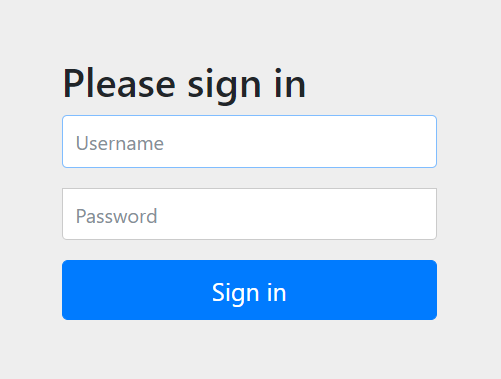
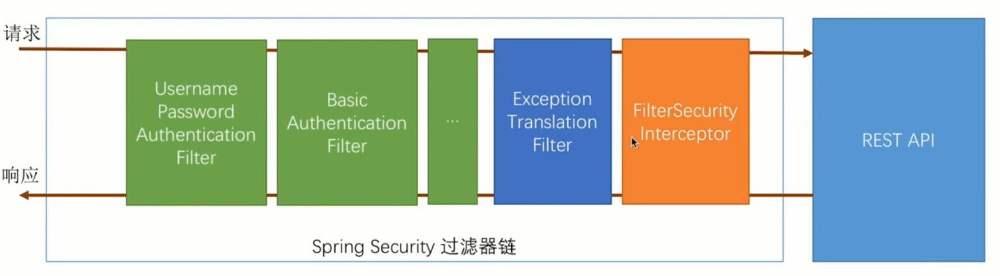

## Spring Security

在应用中关闭 `Security` 的方法

```java
/**
 * 编写配置类，继承 WebSecurityConfigurerAdapter 重写 configure 方法
 */
@Configuration
public class SelfSecurityConfig extends WebSecurityConfigurerAdapter {

    @Override
    protected void configure(HttpSecurity http) throws Exception {
        http.authorizeRequests().antMatchers("/**").permitAll();
    }

}
```


### 一、简介

#### 1、Spring Security 核心功能

- 认证（你是谁），登录
- 授权（能干什么）
- 攻击防护（防止伪造身份）

#### 2、Spring Security  基本原理

Spring Security 在默认会将所有的请求都加上保护，请求之前进行身份认证。



Spring Security 实际上是一组过滤器链



#### 3、自定义用户认证逻辑

