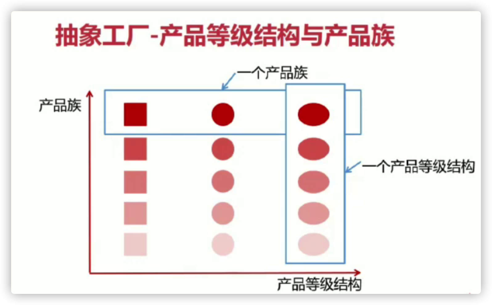

## 设计模式

### 一、UML基础

#### 1. 记忆技巧 - 箭头方向

- 定义子类时需要通过 `extends` 关键字指定父类
- 子类一定知道父类的定义，但父类不一定知道子类的定义
- 只有知道对方的信息时才能指向对方
- 所以箭头方向是子类指向父类

#### 2. 记忆技巧 - 实线空心三角 - 继承 / 虚线空心三角 - 实现

- 空心三角箭头：继承或实现
- 实线 - 继承，`is a` 的关系，扩展目的，不虚，很结实
- 虚线 - 实现，虚线代表 “虚” 无实体（接口不能实例化）

#### 3. 记忆技巧 - 实线（箭头）关联 | 虚线（箭头）依赖

- 虚线 - 依赖关系：临时用一下，若即若离、虚无缥缈、若有若无（方法参数，自由在调用方法的时候才会用到）
- 虚线：表示一种使用关系，一个类需要借助另一个类来实现功能
- 虚线：一般是一个类使用另一个类作为参数或返回值
- 实线 - 关联关系：关系稳定、实打实的关系
- 实线：表示一个类对象和另一个类对象有关联
- 实线：通常是一个类中有另一个类对象作为属性

#### 4. 空心菱形 - 聚合 | 实心菱形 - 组合

- 菱形可以看做是一个盛东西的器皿
- 聚合：代表空器皿里可以放很多相同的东西，聚在一起（菱形箭头方向所指向的类）
- 组合：代表满器皿，已经有实体结构的存在，生死与共

#### 5. 记忆技巧 - 空心菱形（聚合）

- 整体和局部的关系，两者有着独立的生命周期，是 `has a` 的关系（大雁群 has a 大雁）
- 是一种弱关系
- 消极的关系 弱 - 空

#### 6. 记忆技巧 - 实心菱形（组合）

- 整体与局部的关系，和聚合关系相比关系更加强烈，两者有着相同的生命周期，`contains-a` 的关系
- 强关系
- 积极的词 强 - 满

#### 7. 数字表达及含义（实心菱形 - 组合）

假设有 A 类和 B 类，数字标记在 A 类侧

- 0..1：0或1个实例
- 0..*：0或多个实例
- 1..1：1个实例
- 1：只能有一个实例
- 1..*：至少有一个实例

#### 8. UML时序图

是显示对象之间交互的图，这些对象是按时间顺序排列的。时序图中包括的建模元素主要有

> 对象（Actor）、生命线（Lifeline）、控制焦点（Focus of control）、消息（Message）等


### 二、设计原则

#### 1. 开闭原则

定义：一个软件实体如类、模块和函数应该对扩展开放，对修改关闭。用抽象构建框架，用实现扩展细节。

优点：提高软件系统的可复用性和可维护性

#### 2. 依赖倒置原则

定义：高层模块不应该依赖，二者都应该依赖其抽象；抽象不应该依赖细节，细节应该依赖抽象；针对接口编程，而不要针对实现编程。

优点：可以减少类间的耦合性、提高系统稳定性、提高代码可读性和可维护性，可降低修改程序所造成的的风险。

#### 3. 单一职责原则

定义：不要存在一个导致类变更的原因；一个类/接口/方法只负责一项职责

优点：降低类的负责度，提高类的可读性，提高系统的可维护性，降低变更引起的风险

#### 4. 接口隔离原则

定义：定义多个专门的接口，而不是使用单一的总接口，客户端不应该依赖它不需要的接口；一个类对一个类的依赖应该建立在最小的接口上；建立单一接口，不要建立庞大臃肿的接口；尽量细化接口，接口中的方法尽量少。

注意适度原则，一定要适度

优点：符合高内聚、低耦合的设计思想，从而使类具有更好的可读性、可拓展性和可维护性。

#### 5. 迪米特法则

定义：一个对象应该对其它的对象保持最少的了解，又叫最少知道原则。尽量降低类与类之间的耦合。强调只和朋友交流，不和陌生人说话

优点：降低类之间的耦合

> 朋友：出现在成员变量、方法的输入输出参数中的类称为成员朋友类，而出现在方法体内部的类不属于朋友类。

#### 6. 里氏替换原则

定义：子类可以扩展父类的功能，但不能改变父类原有的功能。子类必须实现父类的抽象方法，但不得重写（覆盖）父类的非抽象（已实现）方法。

#### 7. 合成复用原则

定义：要尽量先使用组合或者聚合等关联关系来实现，其次才考虑使用继承关系来实现。

### 三、创建型模式

#### 1. 简单工厂模式

**定义**：由一个工厂对象决定创建出哪个类的实例；属于创建型模式，但不属于23种设计模式

**适用场景**：工厂类创建的对象比较少，客户端（应用层）只知道传入工厂类的参数，对于如何创建对象不关心

**优点**：只需传入一个正确的参数即可获取所需的对象

**缺点**：工厂类的职责相对过重，增加新的类时需要修改工厂类的判断逻辑，违背开闭原则

```java
public Video createVideo(String type) {
    if ("java".equals(type)) {
        return new JavaVideo();
    } else if ("python".equals(type)) {
        return new PythonVideo();
    } else {
        return null;
    }
}
```

#### 2. 工厂方法模式

**定义**：定义一个创建对象的接口，让实现这个接口的类来决定实例化那个类的对象，工厂方法让类的实例化推迟到子类中进行

**适用场景**：创建对象需要大量重复的代码，客户端不依赖于产品类的实例如何被创建实现等细节

**优点**：只需要关心所需要的对象所对应的工厂，无需关系创建细节；加入新的类符合开闭原则，提高可扩展性

**缺点**：类的个数容易过多，增加复杂度；增加了系统的抽象性和理解难度

```java
public interface VideoFactoryMethod {
    Video createVideo();
}
```

```java
public class JavaVideoMethod implements VideoFactoryMethod {
    @Override
    public Video createVideo() {
        return new JavaVideo();
    }
}
```

```java
public class PythonVideoMethod implements VideoFactoryMethod {
    @Override
    public Video createVideo() {
        return new PythonVideo();
    }
}
```

#### 3. 抽象工厂模式

**定义**： 抽象工厂模式提供一个创建一系列相关或相互依赖对象的接口；无需指定具体的类

**适用场景**：客户端不依赖于产品类实例如何被创建、实现等细节；强调一系列相关的产品对象（属于同一产品族）一起使用创建对象需要大量重复的代码；提供一个产品类的库，所有的产品以同样的接口出现，从而使客户端不依赖于具体实现。

**优点**：具体产品在应用层代码隔离，无需关心创建细节；将一个系列的产品族统一到一起创建。

**缺点**：规定了所有可能被创建的产品集合，产品族中扩展新的产品困难，需要修改抽象工厂的接口；增加了产品的抽象性和理解难度。



```java
public abstract class Video {
    public abstract void produce();
}
```

```java
public abstract class Article {
    public abstract void produce();
}
```

```java
public class JavaVideo extends Video {
    @Override
    public void produce() {
        System.out.println("java视频");
    }
}
```

```java
public class JavaArticle extends Article {
    @Override
    public void produce() {
        System.out.println("java手记");
    }
}
```

```java
public interface CourseFactory {
    Video getVideo();
    Article getArticle();
}
```

```java
public class JavaCourseFactory implements CourseFactory {
    @Override
    public Video getVideo() {
        return new JavaVideo();
    }

    @Override
    public Article getArticle() {
        return new JavaArticle();
    }
}
```

#### 4. 建造者模式

**定义**：将一个复杂对象的构建和它的表示分离，使得同样的构建过程可以创建不同的表示。用户只需指定需要建造的类型就可以得到它们，建造的过程及细节不需要知道。

**适用场景**：一个对象有非常复杂的内部结构（很多属性）

**优点**：封装性好，创建和使用分离；扩展性好，建造类之间独立，一定程度上解耦

**缺点**：产生多余的builder对象，产品内部发生变化时，建造者都要修改，成本较大

```java
public class Course {
    private String courseName;
    private String coursePPT;
    private String courseVideo;
    private String courseArticle;
    private String courseQA;

    public String getCourseName() {
        return courseName;
    }

    public void setCourseName(String courseName) {
        this.courseName = courseName;
    }

    public String getCoursePPT() {
        return coursePPT;
    }

    public void setCoursePPT(String coursePPT) {
        this.coursePPT = coursePPT;
    }

    public String getCourseVideo() {
        return courseVideo;
    }

    public void setCourseVideo(String courseVideo) {
        this.courseVideo = courseVideo;
    }

    public String getCourseArticle() {
        return courseArticle;
    }

    public void setCourseArticle(String courseArticle) {
        this.courseArticle = courseArticle;
    }

    public String getCourseQA() {
        return courseQA;
    }

    public void setCourseQA(String courseQA) {
        this.courseQA = courseQA;
    }

    @Override
    public String toString() {
        return "Course{" +
                "courseName='" + courseName + '\'' +
                ", coursePPT='" + coursePPT + '\'' +
                ", courseVideo='" + courseVideo + '\'' +
                ", courseArticle='" + courseArticle + '\'' +
                ", courseQA='" + courseQA + '\'' +
                '}';
    }
}
```

```java
public abstract class CourseBuilder {
    public abstract void buildCourseName(String courseName);
    public abstract void buildCoursePPT(String coursePPT);
    public abstract void buildCourseVideo(String courseVideo);
    public abstract void buildCourseArticle(String courseArticle);
    public abstract void buildCourseQA(String courseQA);
    public abstract Course makeCourse();
}
```

```java
public class CourseActualBuilder extends CourseBuilder {
    private Course course = new Course();

    @Override
    public void buildCourseName(String courseName) {
        course.setCourseName(courseName);
    }

    @Override
    public void buildCoursePPT(String coursePPT) {
        course.setCoursePPT(coursePPT);
    }

    @Override
    public void buildCourseVideo(String courseVideo) {
        course.setCourseVideo(courseVideo);
    }

    @Override
    public void buildCourseArticle(String courseArticle) {
        course.setCourseArticle(courseArticle);
    }

    @Override
    public void buildCourseQA(String courseQA) {
        course.setCourseQA(courseQA);
    }

    @Override
    public Course makeCourse() {
        return course;
    }
}
```

```java
public class Coach {

    private CourseBuilder courseBuilder;

    public void setCourseBuilder(CourseBuilder courseBuilder) {
        this.courseBuilder = courseBuilder;
    }

    public Course makeCourse(String courseName, String coursePPT, String courseVideo,
                             String courseArticle, String courseQA) {
        this.courseBuilder.buildCourseName(courseName);
        this.courseBuilder.buildCoursePPT(coursePPT);
        this.courseBuilder.buildCourseVideo(courseVideo);
        this.courseBuilder.buildCourseArticle(courseArticle);
        this.courseBuilder.buildCourseQA(courseQA);
        return this.courseBuilder.makeCourse();
    }
}
```

```java
public class CoachTest {
    @Test
    public void testCourseBuilder() {
        Coach coach = new Coach();
        coach.setCourseBuilder(new CourseActualBuilder());
        Course java = coach.makeCourse("java", "java-PPT", "java-video",
                "java-Article", "java-QA");
        System.out.println(java);
    }
}
```

版本2：

```java
public class Course {
    private String courseName;
    private String coursePPT;
    private String courseVideo;
    private String courseArticle;
    private String courseQA;

    public Course(CourseBuilder courseBuilder) {
        this.courseName = courseBuilder.courseName;
        this.coursePPT = courseBuilder.coursePPT;
        this.courseVideo = courseBuilder.courseVideo;
        this.courseArticle = courseBuilder.courseArticle;
        this.courseQA = courseBuilder.courseQA;
    }

    @Override
    public String toString() {
        return "Course{" +
                "courseName='" + courseName + '\'' +
                ", coursePPT='" + coursePPT + '\'' +
                ", courseVideo='" + courseVideo + '\'' +
                ", courseArticle='" + courseArticle + '\'' +
                ", courseQA='" + courseQA + '\'' +
                '}';
    }

    public static class CourseBuilder {
        private String courseName;
        private String coursePPT;
        private String courseVideo;
        private String courseArticle;
        private String courseQA;

        public CourseBuilder buildCourseName(String courseName) {
            this.courseName = courseName;
            return this;
        }

        public CourseBuilder buildCoursePPT(String coursePPT) {
            this.coursePPT = coursePPT;
            return this;
        }

        public CourseBuilder buildCourseVideo(String courseVideo) {
            this.courseVideo = courseVideo;
            return this;
        }

        public CourseBuilder buildCourseArticle(String courseArticle) {
            this.courseArticle = courseArticle;
            return this;
        }

        public CourseBuilder buildCourseQA(String courseQA) {
            this.courseQA = courseQA;
            return this;
        }

        public Course build() {
            return new Course(this);
        }
    }
}
```

```java
public class CourseBuilderTest {

    @Test
    public void testCourseBuilder() {
        Course build = new Course.CourseBuilder()
                .buildCourseName("java")
                .buildCourseArticle("Article")
                .buildCoursePPT("PPT")
                .buildCourseQA("QA")
                .buildCourseVideo("video")
                .build();
        System.out.println(build);
    }
}
```

#### 5. 单例模式

**定义**：保证一个类只有一个实例，并提供一个全局访问点

**适用场景**：确保任何情况下都绝对只有一个实例

**优点**：只有一个实例，减少了内存的开销；避免对资源的多重占用；设置全局访问点，严格控制访问

**缺点**：没有借口，扩展困难

**重点**：私有构造器；线程安全；延迟加载；序列化反序列化安全；反射

##### 5.1 懒汉式

````java
public class LazySingleton {

    private static LazySingleton lazySingleton = null;
    private LazySingleton() {

    }
    public static LazySingleton getInstance() {
        if (lazySingleton == null) {
            lazySingleton = new LazySingleton();
        }
        return lazySingleton;
    }
}

/**
 * 测试
 */
public class LazySingletonTest {
    @Test
    public void testLazySingleton() {
        LazySingleton instance = LazySingleton.getInstance();
        System.out.println(instance.hashCode());
    }

    @Test
    public void testLazyThreadSingleton() {
        for (int i = 0; i < 10; i++) {
            new Thread(() -> {
                LazySingleton instance = LazySingleton.getInstance();
                System.out.println(instance.hashCode());
            }).start();
        }
    }
}
````

双重检查：

```java
public class LazyDoubleCheckSingleton {
    // volatile修饰的变量不允许线程内部缓存和重排序
    private volatile static LazyDoubleCheckSingleton doubleCheckSingleton = null;
    private LazyDoubleCheckSingleton() {
    }

    public static LazyDoubleCheckSingleton getInstance() {
        if (doubleCheckSingleton == null) {
            synchronized (LazyDoubleCheckSingleton.class) {
                if (doubleCheckSingleton == null) {
                    doubleCheckSingleton = new LazyDoubleCheckSingleton();
                }
            }
        }
        return doubleCheckSingleton;
    }
}

public class LazyDoubleCheckSingletonTest {
    @Test
    public void testLazyThreadSingleton() {
        for (int i = 0; i < 10; i++) {
            new Thread(() -> {
                LazyDoubleCheckSingleton instance = LazyDoubleCheckSingleton.getInstance();
                System.out.println(instance.hashCode());
            }).start();
        }
    }
}
```

静态内部类：

```java
public class StaticInnerClassSingleton {
    private StaticInnerClassSingleton() {
        if (InnerClass.INNER_CLASS_SINGLETON != null) {
            throw new RuntimeException("单例构造器禁止反射调用");
        }
    }
    
    /**
     * 静态内部类
     */
    private static class InnerClass {
        private static StaticInnerClassSingleton INNER_CLASS_SINGLETON = new StaticInnerClassSingleton();
    }

    public static StaticInnerClassSingleton getInstance() {
        return InnerClass.INNER_CLASS_SINGLETON;
    }
}

public class StaticInnerClassSingletonTest {
    @Test
    public void testLazyThreadSingleton() {
        for (int i = 0; i < 10; i++) {
            new Thread(() -> {
                StaticInnerClassSingleton instance = StaticInnerClassSingleton.getInstance();
                System.out.println(instance.hashCode());
            }).start();
        }
    }
}
```

##### 5.2 饿汉式

```java
public class HungrySingleton {
    private final static HungrySingleton INSTANCE = new HungrySingleton();
    private HungrySingleton() {
    }
    
    public static HungrySingleton getInstance() {
        return INSTANCE;
    }
}
```

##### 5.3 序列化/反序列化获取单例对象解决方案

在单例类中添加方法 `readResolve` 

```java
private Object readResolve() {
    return INSTANCE;
}
```

```java
public class HungrySingletonTest {

    @Test
    public void testHungrySingleton() throws IOException, ClassNotFoundException {
        HungrySingleton instance = HungrySingleton.getInstance();
        ObjectOutputStream oos = new ObjectOutputStream(new FileOutputStream("hungrySingleton"));
        oos.writeObject(instance);

        File file = new File("hungrySingleton");
        ObjectInputStream ois = new ObjectInputStream(new FileInputStream(file));
        HungrySingleton newInstance = (HungrySingleton) ois.readObject();
        System.out.println(instance == newInstance);
    }

}
```

##### 5.4 反射单例对象解决方案

使用反射的方式获取对象从而破坏单例，解决方案仅对饿汉式单例有效，对懒汉式单例无效

```java
@Test
public void testReflectionSingleton() throws NoSuchMethodException, IllegalAccessException, InvocationTargetException, InstantiationException {
    HungrySingleton instance = HungrySingleton.getInstance();
    Class<HungrySingleton> objectClass = HungrySingleton.class;
    Constructor<HungrySingleton> declaredConstructor = objectClass.getDeclaredConstructor();
    declaredConstructor.setAccessible(true);
    HungrySingleton newInstance = declaredConstructor.newInstance();
    System.out.println(instance == newInstance);
}
```

```java
private HungrySingleton() {
    if (INSTANCE != null) {
        throw new RuntimeException("单例构造器禁止反射调用");
    }
}
```

#### 6. 原型模式

**定义**： 原型实例指定创建对象的种类，并且通过拷贝这些原型创建新的对象。不需要知道任何创建的细节，不调用构造函数

**适用场景**： 类初始化消耗较多的资源；new产生的对象需要非常繁琐的过程（数据准备、访问权限等）；构造函数比较复杂；需要在循环体中产生大量的对象时

**优点**： 性能比直接new一个对象高；简化创建过程

**缺点**： 必须配备克隆方法；对克隆复杂对象或对克隆对象进行复杂改造时，容易引入风险

### 四、结构型模式

### 五、行为模式

