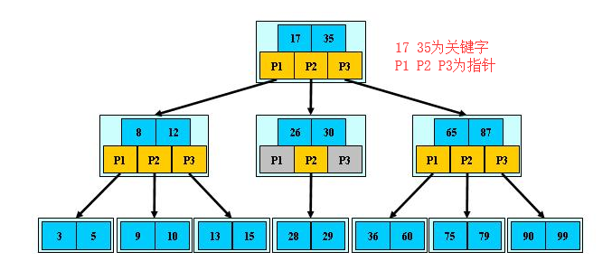
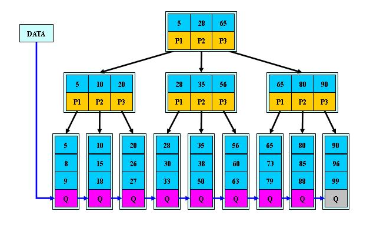
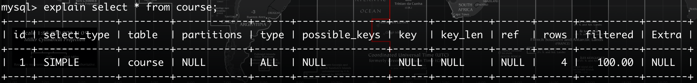

## 一、MySQL数据库：

数据库是按照数据结构来组织、存储和管理数据的仓库。**MySQL**是一种关系型数据库，数据以表格的形式出现，每行为各种记录的名称，每列为记录名称所对应的数据域，许多个行和列组成一个表单，若干的表单组成**database**。

#### 1、MySQL相关术语：

|    术语    |                             解释                             |
| :--------: | :----------------------------------------------------------: |
|   数据库   |                   数据库是一些关联表的集合                   |
|   数据表   |                       表是数据的矩阵，                       |
|     列     |                     一列包含了相同的数据                     |
|     行     |                     一行是一组相关的数据                     |
|     值     |          行的具体信息，每个值应与该列的数据类型相同          |
|    冗余    |       存储两倍数据，冗余降低了性能但提高了数据的安全性       |
|    主键    |           主键是唯一的，一个数据表中只包含一个主键           |
|    外键    |                      外键用于关联两个表                      |
|   复合键   |                 符合键将多个列作为一个索引键                 |
|    索引    |           使用索引可以快速访问数据库表中的特定信息           |
| 参照完整性 | 参照的完整性要求关系中不允许引用不存在的实体。与实体完整性是关系模型必须满足的完整性约束条件，目的是保证数据的一致性。 |
|    表头    |                         每一列的名称                         |

#### 2、MySQL数据类型：

- **数值类型：**

  |   类型   | 大小  |                        范围（有符号）                        |                        范围（无符号）                        |
  | :------: | :---: | :----------------------------------------------------------: | :----------------------------------------------------------: |
  | TINYINT  | 1字节 |                         (-128 ~ 127)                         |                          (0 ~ 255)                           |
  | SMALLINT | 2字节 |                       (-32768 ~ 32767)                       |                         (0 ~ 65535)                          |
  |   INT    | 4字节 |               (-2 147 483 648 ~ 2 147 483 647)               |                     (0 ~ 4 294 967 295)                      |
  |  BIGINT  | 8字节 |   (-9 233 372 036 854 775 808 ~ 9 223 372 036 854 775 807)   |               (0 ~ 18 446 744 073 709 551 615)               |
  |  FLOAT   | 4字节 | (-3.402 823 466 E+38，-1.175 494 351 E-38)，0，(1.175 494 351 E-38，3.402 823 466 351 E+38) |         0，(1.175 494 351 E-38，3.402 823 466 E+38)          |
  |  DOUBLE  | 8字节 | (-1.797 693 134 862 315 7 E+308，-2.225 073 858 507 201 4 E-308)，0，(2.225 073 858 507 201 4 E-308，1.797 693 134 862 315 7 E+308) | 0，(2.225 073 858 507 201 4 E-308，1.797 693 134 862 315 7 E+308) |

  **float(m,d)：** 单精度浮点型，m 表示总位数（包括小数部分），d 表示小数位数。

  **double(m,d)：** 双精度浮点型，m 表示总位数（包括小数部分），d 表示小数位数。

  > 向表中插入数据时，整数部分或进位后的整数部分位数不能超过 **m - d** 位。

- **日期和时间类型：**

  |   类型    | 大小  |                             范围                             |        格式         |
  | :-------: | :---: | :----------------------------------------------------------: | :-----------------: |
  |   DATE    | 3字节 |                    1000-01-01/9999-12-31                     |     yyyy-MM-dd      |
  |   TIME    | 3字节 |                   '-838:59:59'/'838:59:59'                   |      hh:mm:ss       |
  | DATETIME  | 8字节 |           1000-01-01 00:00:00/9999-12-31 23:59:59            | yyyy-MM-dd hh:mm:ss |
  | TIMESTAMP | 4字节 | 1970-01-01 00:00:00/2038     结束时间是第 **2147483647** 秒，北京时间 **2038-1-19 11:14:07**，格林尼治时间 2038年1月19日 凌晨 03:14:07 | yyyy-MM-dd hh:mm:ss |

- **字符串类型：**

  |  类型   |     大小      |    用途    |
  | :-----: | :-----------: | :--------: |
  |  CHAR   |  0 ~ 255字节  | 定长字符串 |
  | VARCHAR | 0 ~ 65535字节 | 边长字符串 |
  |  TEXT   | 0 ~ 65535字节 | 长文本数据 |

#### 3、SQL约束：

SQL 约束用于规定表中的数据规则，如果存在违反约束的数据行为，行为会被约束终止。

|      约束       |                          含义                          |
| :-------------: | :----------------------------------------------------: |
|  **NOT NULL**   |                指某列数据不能存储NULL值                |
|   **UNIQUE**    |              保证某列的每行必须为唯一的值              |
| **PRIMARY KEY** | 主键，确定一个表中的唯一标识，有助于快速查找特定的记录 |
|   **DEFAULT**   |      规定数据列的默认值，当列没有赋值时使用默认值      |

#### 4、数据库操作：

- **创建数据库：**

  ```sql
  #创建数据库并指定编码集
  CREATE DATABASE [IF NOT EXISTS] `数据库名` DEFAULT CHARACTER SET UTF8;
  ```

- **创建数据表：**

  ```sql
  #创建数据表并指定存储引擎和字符编码
  CREATE TABLE [IF NOT EXISTS] `表名`(
  	`字段名1` 数据类型 约束条件,
      `字段名2` 数据类型 约束条件,
      `字段名3` 数据类型 约束条件
  )ENGINE=INNODB CHARSET=UTF8;
  ```

- **维护数据库、数据表：**

  ```sql
  #查看表结构
  DESC 表名；
  
  #增加字段
  ALTER TABLE 表名 ADD 字段名 数据类型 约束条件;
  
  #修改字段
  ALTER TABLE 表名 CHANGE 旧字段名 新字段名 新字段数据类型 新字段约束;
  ALTER TABLE 表名 MODIFY 字段名称 数据类型 字段约束;
  # 注意：
  # 使用CHANGE时需要给定新字段名的类型,CHANGE不仅能修改字段名还能修改字段类型
  # MODIFY关键字不能修改字段名称,只能修改字段类型、约束条件
  
  #删除字段
  ALTER TABLE 表名 DROP COLUMN 字段名;
  
  #修改表名
  RENAME TABLE 旧表名 TO 新表名;
  
  #删除表
  DROP TABLE 表名;
  
  #删除数据
  DELETE FROM 表名 WHERE 条件;
  ```


#### 5、数据表操作：

- **添加记录：**

  >INSERT INTO 语句用于向表中插入新记录。 

  ```SQL
  #向数据表中增加记录
  INSERT INTO 表名(字段名1,字段名2,...) VALUES(值1,值2,...);
  
  #向表中增加多条记录方法一：
  INSERT INTO 表名 VALUES (值1,值2,...),
  (值1,值2,...),
  (值1,值2,...),
  ...
  ;
  
  #向表中增加多条记录方法二：
  INSERT INTO 表名 VALUES (值1,值2,...)；
  INSERT INTO 表名 VALUES (值1,值2,...)；
  INSERT INTO 表名 VALUES (值1,值2,...)；
  ```

  **注意：** 在向表中新增数据时，可以在表名后写上添加数据的字段，此时`VALUES`括号中的值需要和指定的字段一一对应；若不在表名后面指定字段需要在`VALUES`后的括号中根据建表时字段的顺序赋值且不能省略，个数要和建表的字段一致。如果表中有自增主键，可以给主键赋值`null`。

- **更新表数据：**

  > UPDATE 语句用于更新表中的记录。 

  ```sql
  #修改数据
  UPDATE 表名 SET 字段名1 = 值1, 字段名2 = 值2, ... WHERE 条件;
  ```

  **注意：** 更新表数据时一定要指定更新哪一条数据，如果省略`WHERE 条件`语句，这一步操作将更新整个数据表中的所有记录数据。

- **删除数据：**

  > DELETE 语句用于删除表中的记录。 

  ```sql
  #删除记录
  DELETE FROM 表名 WHERE 条件;
  
  #删除所有记录
  DELETE FROM 表名;
  DELETE * FROM 表名;
  ```

  **注意：** 如果删除时不指定`WHERE 条件`该操作将删除整个表中的所有记录。

- **简单查询：**

  > SELECT 语句用于从数据库中选取数据。 

  ```sql
  #查询数据
  SELECT 字段名1,字段名2,... FROM 表名;	#查询表中指定字段的数据信息
  SELECT * FROM 表名;					#查询表中所有字段的信息
  
  #去重复查询
  SELECT DISTINCT 字段名1,字段名2,... FROM 表名;	#DISTINCT后指定字段名将根据字段名进行去重，如果指定为*											 #则根据所有字段进行去重。
  ```

- **ADN & OR 运算符：**

  > AND & OR 运算符用于基于一个以上的条件对记录进行过滤。 

  ```sql
  #AND要求所有条件必须满足
  SELECT * FROM student WHERE sex = "男" AND age >=18;		#表示找出年龄大于等于18的男生
  
  #OR 只要有一个条件满足即可
  SELECT * FROM student WHERE sex = "女" OR age >=18;		#表示查询出性别为女或者年龄大于等于18的同														   #学，也可能年龄大于等于18为男生。
  
  #AND 和 OR结合使用
  SELECT * FROM student WHERE sex = "男" AND (score > 80 OR age > 18);
  														#查询出成绩大于80或年龄大于18的男生
  ```

- **ORDER BY 排序：**

  > ORDER BY 关键字用于对结果集进行排序。 

  ```sql
  #ORDER BY 关键字用于对结果集按照一个列进行排序
  SELECT * FROM student WHERE age > 18 ORDER BY sid DESC;	#查询年龄大于18的所有记录并按编号降序排列
  
  #ORDER BY 关键字用于对结果集按照一个列进行排序
  SELECT * FROM student WHERE age > 18 ORDER BY name, sid DESC;
  						#查询出所有年龄大于18并按照名称和编号进行降序排列，如果名称相同则按照编号排序
  ```

  **DESC：**降序             	                                            **ASC：**升序（默认）

#### 6、高级应用：

- **外键约束：** **外键所在的表是从表，外键命名规则：fk_ 从表名_主表名** 

  ```sql
  #1、建表时关联外键
  CREATE TABLE 表名(
  	字段名1 字段类型 约束条件,
      字段名2 字段类型 约束条件,
      FOREIGN KEY(子表外键字段) REFERENCRS 主表名(主表主键字段)
  );
  
  #2、建表示指定外键并命名
  CREATE TABLE 表名(
  	字段名1 字段类型 约束条件,
      字段名2 字段类型 约束条件,
      CONSTRAINT 外键别名 FOREIGN KEY(从表外键字段) REFERENCRS 主表名(主表主键字段)
  );
  
  #3、建表后使用ALTER TABLE新增外键
  ALTER TABLE 表名 ADD FOREIGN KEY(从表字段名) REFERENCRS 主表名(主表主键字段);
  ALTER TABLE 表名 ADD CONSTRAINT 外键名 FOREIGN KEY(从表字段名) REFERENCES 主表名(主表主键字段);
  
  #4、撤销外键
  ALTER TABLE 表名 DROP FOREIGN KEY 外键名称;
  ```

- **AS 别名：**

  > 通过使用AS关键字可以为表名称或列名称指定别名，AS可以省略

  ```sql
  SELECT 字段名 AS 别名 FROM 表名；	#查询后列的名称将显示别名名称
  ```

- **WHERE 条件中的比较：**

  在`WHERE`中可以使用运算符对查询结果进行约束。

  - **BETWEEN ... AND 区间查询:**

    ```sql
    SELECT * FROM student WHERE age BETWEEN 18 AND 23;	#查询年龄在18到23之间的所有学生
    
    #等价于
    SELECT * FROM student WHERE age >=18 AND age <=23;
    ```

  - **IN 操作符：**

    ```sql
    #IN 操作符允许在 WHERE 语句中规定多个值
    SELECT * FROM 表名 WHERE 字段名 IN (值1,值2,...);
    SELECT * FROM student WHERE age IN (18,20,25);	#根据IN中的范围查询年龄为18,20,25的学生
    ```

  - **LIKE 模糊查询：**

    | 通配符 |       描述        |
    | :----: | :---------------: |
    |   %    | 替代0个或多个字符 |
    |   _    |   替代一个字符    |

    ```sql
    #查询姓李的所有学生
    SELECT * FROM student WHERE name LIKE "李%";		#姓李，名字长度不限
    
    #查询姓吴且名字为两个字的学生
    SELECT * FROM student WHERE name LIKE "吴_";		#姓吴，名字长度为2
    ```

  - **LIMIT 分页查询：**

    ```sql
    #分页查询
    SELECT * FROM 表名 LIMIT 起始位置, 返回记录条数;	#从起始位置下一个开始，返回指定记录条数
    
    SELECT * FROM student LIMIT 0,10;	#从第1条开始查询，显示10条记录
    
    SELECT * FROM student WHERE sid > 10 LIMIT 0,5;
    ```

- **SQL 聚合函数：**

  |  函数   |             含义             |
  | :-----: | :--------------------------: |
  | COUNT() |        返回记录总条数        |
  |  AVG()  |          返回平均值          |
  |  SUM()  | 返回总和（字段能够参与运算） |
  |  MAX()  |          返回最大值          |
  |  MIN()  |          返回最小值          |
  | FIRST() |      返回第一个记录的值      |
  | LAST()  |     返回最后一个记录的值     |

  ```sql
  SELECT COUNT(*) FROM student WHERE age > 18;	#查询年龄大于18岁的学生人数
  SELECT AVG(age) FROM student;					#查询所有学生的平均年龄
  SELECT SUM(score) FROM student WHERE sid = 1;	#查询编号为1的学生的成绩总和
  SELECT MAX(age) FROM student;					#查询所有学生中年龄最大的学生
  SELECT MIN(age) FROM student;					#查询所有学生中年龄最小的学生
  ```

- **GROUP BY 分组：**

  > GROUP BY 语句根据一个或多个列对结果集进行分组。 

  ```sql
  #格式
  GROUP BY 字段名;		#按照指定的字段进行分组，将该字段中值相等的分为一组
  
  SELECT COUNT(sid) FROM student GROUP BY sex;	#将学生表按性别分组并分别统计不同组的人数
  ```

- **HAVING 关键字：**

  > 在 SQL 中增加 HAVING 子句原因是，WHERE 关键字无法与聚合函数一起使用。	HAVING关键字可以筛选分组后的数据。

  ```sql
  #格式
  SELECT * FROM 表名 GROUP BY 字段名 HAVING 条件;
  
  SELECT clsid,COUNT(sid) AS number FROM student GROUP BY clsid HAVING number > 2;
  #从学生表根据班级分组查询班级编号，班级学生总人数，并筛选班级人数大于2的数据。
  ```

- **HAVING 和 WHERE 的区别：**

  WHERE、聚合函数、HAVING 在 FROM 后的执行顺序

  >**WHERE > 聚合函数(SUM(), MIN(), MAX(), AVG(), COUNT()) > HAVING** 

  ```sql
  #对分组后的数据进行筛选
  SELECT SUM(score) FROM student WHERE sex='man' GROUP BY name HAVING SUM(score)>210;
  ```

  **注意：** 若须引入聚合函数来对`GROUP BY`结果进行筛选则只能使用`HAVING`关键字。

  1、**WHERE** 后不能跟聚合函数，因为 **WHERE** 执行顺序大于聚合函数。

  2、**WHERE** 子句的作用是在对查询结果进行分组前，将不符合 **WHERE** 条件的行去掉，即在分组前进行数据过滤。**WHERE条件中不能包含聚合函数**。

  3、**HAVING** 子句的作用的筛选满足条件的组，即**在分组之后过滤数据**，条件中经常包含聚合函数，使用**HAVING**条件显示特定的组。

  ```sql
  SELECT COUNT(*),btype FROM book WHERE bprice > 60 GROUP BY btype HAVING COUNT(*) > 1;
  ```

- **多表联查：**

  - 用第一个查询的结果作为第二个查询的条件

    ```sql
    SELECT * FROM student WHERE sid IN (SELECT cid FROM clazz WHERE cname = "101班");
    ```

  - **内连接（INNER JOIN）：**

    内连接又叫等值连接，使用比较运算符根据每个表共有的列的值匹配两个表中的行，根据条件得出两个表的交集。

    ```sql
    #等值内连，查询书籍对应的分类
    SELECT bk.bname, bt.tname 
    FROM book AS bk, book_type AS bt 
    WHERE bk.btype = bt.tid;
    
    #INNER JOIN
    SELECT bk.bname, bt.tname
    FROM book AS bk
    INNER JOIN book_type AS bt
    ON bk.btype = bt.tid;
    
    #两条语句的查询结果一样，其中“INNER”可以省略
    ```

  - **左外连接：**

    从左表返回所有的行，即使友表中没有匹配，如果右表中没有匹配则显式结果为NULL。左连接查询会将左表中的数据全部显式出来，如果跟右表匹配则显式右表数据，没有匹配则显式NULL。

    ```sql
    #格式
    SELECT t1.*, t2.*
    FROM table1 AS t1
    LEFT JOIN table2 AS t2
    ON t1.tid = t2.tid;
    
    SELECT s.*, c.*
    FROM student s
    LEFT JOIN clazz c
    ON s.sid = c.cid;
    ```

  - **右外链接：**

    右外连接的含义和左外连接相反，它是以右边的表为主，查询显式所有右表的信息，当左表不匹配时显式NULL。

    ```sql
    #格式
    SELECT t1.*, t2.*
    FROM table1 AS t1
    RIGHT JOIN table2 AS t2
    ON t1.tid = t2.tid;
    
    SELECT s.*, c.*
    FROM student s
    RIGHT JOIN clazz c
    ON s.sid = c.cid;
    ```

  - **UNION：**

    **UNION**  操作符用来合并两个或多个 SELECT 语句的结果集，并去掉结果集中的重复部分。 **UNION ALL** 关键字同样用来合并多个查询的结果集，但该关键字允许有重复的记录，即显式合并查询的所有记录。

    ```sql
    #格式
    SELECT * FROM table1
    UNION
    SELECT * FROM table2;		#该语句会将表1和表2中查出来的数据合并显式，并去掉重复的记录
    
    SELECT * FROM table1
    UNION ALL
    SELECT * FROM table2;		#该语句会将表1和表2中查出来的数据合并显式，不去掉重复的记录
    ```

  - **在MySQL中实现 FULL JOIN 效果：**

    在MySQL中是不支持 **FULL JOIN** 连接查询的。可以通过 **UNION** 关键字实现形同的效果。

    ```sql
    #使用UNION关键字实现 FULL JOIN 的效果
    SELECT t1.*, t2.* FROM table1 AS t1 LEFT JOIN table2 AS t2 ON t1.tid = t2.tid
    UNION
    SELECT t1.*, t2.* FROM table1 AS t1 RIGHT JOIN table2 AS t2 ON t1.tid = t2.tid;
    #该语句会将表1和表2中的所有数据都查询出来，若两表中的数据有不匹配的项，会显示为NULL
    ```


## 二、 SQL加强：

#### 1、my.ini 配置文件：

|         配置项         |          解释           |
| :--------------------: | :---------------------: |
|          port          |        启动端口         |
|        basedir         |      MySQL的主目录      |
|        datadir         | MySQL数据文件存放的位置 |
| character-set-server=  |     默认的字符编码      |
| default-storage-engine |     默认的存储引擎      |
|    max_connections     |     默认最大连接数      |

#### 2、权限操作：

|        表         |                权限                |
| :---------------: | :--------------------------------: |
|    mysql.user     | 用户表，包括用户名、密码、全局权限 |
|     mysql.db      |           数据库权限设置           |
| mysql.table_priv  |             表权限设置             |
| mysql.column_priv |             列权限设置             |


## 三、SQL优化

#### 1、存储引擎

##### 1.1 MyISAM

MyISAM 是 MySQL 的 ISAM 扩展形式，ISAM 在设计时就考虑到数据库被查询的次数远大于更新的次数，因此执行读取操作时的速度非常快；ISAM 不支持事务，不能容错。MyISAM 拥有 ISAM 的所有特点，还有一种表格锁定的机制来优化并发读写操作。MyISAM 的一个重要缺陷是不能在表损坏后恢复数据。数据越多写操作效率越低，因为要维护数据和索引信息（索引列越多，相应效率越低）。

使用 MyISAM 存储引擎会生成3个文件：`.frm` 表结构信息； `.myd` 数据文件； `.myi` 表的索引信息。

##### 1.2 InnoDB

InnoDB 包括了对事物的处理和对外键的支持，给 MySQL 提供了具有提交、回滚和崩溃恢复能力的事物安全存储引擎。InnoDB 存储引擎管理的数据库文件为 `.frm` 和 `.idb` 

##### 1.3 InnoDB和MyISAM的区别

- InnoDB 支持事物，MyISAM 不支持
- InnoDB 支持外键，MyISAM 不支持
- InnoDB 是聚集索引，数据文件和索引绑在一起，必须要有主键，通过主键索引效率很高。但是辅助索引需要两次查询，先查询到主键，然后再通过主键査询到数据。因此，主键不应该过大，因为主键太大，其他索引也都会很大。而MyISAM是非聚集索引，数据文件是分离的，索引保存的是数据文件的指针。主键索引和辅助索引是独立的。
- InnoDB 不保存表的具体行数，执行 `select count(*) from table` 时需要全表扫描。而MyISAM用一个变量保存了整个表的行数，执行上述语句时只需要读出该变量即可，速度很快。
- InnoDB 不支持全文索引，而MyISAM支持全文索引，査询效率上MyISAM要高。

##### 1.4 存储引擎管理

```sql
# 查看数据库支持的存储引擎
SHOW ENGINES;

# 查看数据库当前使用的存储引擎
SHOW VARIABLES LIKE '%engine%';

# 查看数据库表所用的存储引擎
SHOW CREATE TABLE `user`;

# 修改表的存储引擎
alter table table_name engine = engine_name;
```


#### 2、索引

##### 2.1 索引的优点

- 通过建立唯一索引可以保证数据库中每一行数据的唯一性
- 可以大大加快数据的检索速度
- 可以加快表与表之间的连接
- 通过使用索引可以在查询的过程中，使用查询优化器，提高系统的性能

##### 2.2 索引的缺点

- 创建索引和维护索引要耗费时间，这个时间随着数据量的增加而增加
- 索引要占用物理空间，如果要建立聚簇索引，需要的空间会更大
- 当对表进行数据的增加、删除、修改时，索引也需要维护，降低了索引的维护速度

##### 2.3 什么样的字段适合创建索引

- 在经常需要搜索的列上
- 在主键列上，强制该列的唯一性和组织表中数据的排列结构
- 经常用在连接的列上，可以加快连接速度
- 需要根据范围进行搜索的列上
- 需要排序的列上
- 经常使用在 where 子句中的列上

##### 2.4 索引的分类

- 单值索引
- 唯一索引
- 复合索引

创建索引

```sql
-- create 索引类型 索引名 on 表（字段）
create index dept_index on tb(dept);
create unique index name_index on tb(name);
create index dept_name_index on tb(dept, name);

-- alter table 表名 索引类型 索引名（字段）
alter table tb add index dept_index(dept);
alter table tb add unique index name_index(name);
alter table tb add index dept_name_index(dept, name);

-- drop index 索引名 on 表名
drop index name_index on tb;

-- 查询索引
show index from tb;
```


#### 3、MySQL 中的索引类型

MySQL官方对索引的定义为：索引（Index）是帮助MySQL高效获取数据的数据结构。

##### 3.1 B-Tree

B 树是为了磁盘或其它存储设备而设计的一种多叉平衡查找树。（相对于二叉，B树每个内结点有多个分支，即多叉）**B树又可以写成B-树 **`B-Tree，并不是B“减”树，横杠为连接符，容易被误导` 

**一棵 m 阶B-tree的特性：** 

```text
m 阶的定义：一个节点能拥有的最大子节点数来表示这颗树的阶数
举个例子：
如果一个节点最多有 n 个key，那么这个节点最多就会有 n+1 个子节点，这棵树就叫做 n+1（m=n+1）阶树
```

```php
1.每个结点x(假设为x)有如下属性:
  - x.n，表示当前存储在结点x中的关键字个数。
  - x.n的各个关键字本身：x.key1, x.key2, … 以非降序存放(升序)，使得 x.key1 ≤ x.key2 ≤ …
  - x.leaf，是一个布尔值，如果x是叶子结点，则为TRUE, 如果x为内部结点，则为FALSE。

2.每个'内部结点x'还包含x.n+1个指向它的孩子的指针x.c1, x.c2, … 。 叶子结点没有孩子结点，所以他的ci属性没有定义。
 - key和指针互相间隔，节点两端是指针，所以节点中指针比key多一个。
 - 每个指针要么为null，要么指向另外一个节点。

3.关键字x.keyi对存储在各子树中的关键字进行分割：如果ki为任意一个存储在以x.ci为根的子树中的关键字，那么：
k1 ≤ x.key1 ≤ k2 x.key2 ≤ … ≤ x.keyx.n ≤ kx.n+1
难理解可以这么说：
> 如果某个指针在节点node最左边且不为null，则其指向节点的所有key小于(key1)，其中(key1)为node的第一个key的值。

> 如果某个指针在节点node最右边且不为null，则其指向节点的所有key大于(keym)，其中(keym)为node的最后一个key的值。

> 如果某个指针在节点node的左右相邻key分别是keyi和keyi+1且不为null，则其指向节点的所有key小于(keyi+1)且大于(keyi)。

4.每个叶子结点具有相同的深度，即树的高度h

5.每个结点所包含的的关键字个数有上界和下界。用一个被称作B树的最小度数的估计整数t(t ≥ 2)来表示这些界：
除了根结点以外的每个结点必须**至少**有t-1个关键字。因此，除了根节点以外的每个内部结点**至少**有t个孩子。（因为上面说了右x.n+1个指向它的孩子的指针）
如果树非空，根结点至少有一个关键字。
每个结点**最多**包含2t-1个关键字。因此，一个内部节点至多可有2t个孩子。当一个结点恰好有2t-1个关键字时，称该结点是满的(full)。
```



**拿中间一层最左边举例说明：** 

```php
1.  x.n = 2 有两个关键字
    分别为 x.key1 = 8  x.key2 = 12 且 8<12
    x.leaf = false为内部节点
2.  含有3个指向它孩子的指针P1 P2 P3
3.  关键字x.key1=8 它的左边指针P1 对 子树 3 5 分割 满足 3和5都小于8
    关键字x.key1=8 它的右边指针P2 对 子树 9 10 分割 满足 9和10都大于8（同为12的左指针）
    关键字x.key2=12 它的右边指针P3 对 子树 13 15 分割 满足 13和15都大于12
```

##### 3.2 B+Tree



#### 4、explain 关键字

SQL执行顺序：`from -> on -> join -> where -> group by -> having -> select dinstinct -> order by -> limit` 

```sql
-- 查看sql语句执行计划
explain + sql;
```



- id：选择标识符；id相同时从上到下依次执行，id不同时先执行大的再执行小的
- select_type：表示查询的类型
- table：输出结果集的表
- partitions：匹配的分区
- type：表示表的连接类型（system、const、eq_ref、ref、range、index、all）
- possible_keys：表示查询时，可能使用的索引
- key：表示实际使用的索引
- key_len：索引字段的长度
- ref：列与索引的比较
- rows：扫描出的行数(估算的行数)
- filtered：按表条件过滤的行百分比
- Extra：执行情况的描述和说明

